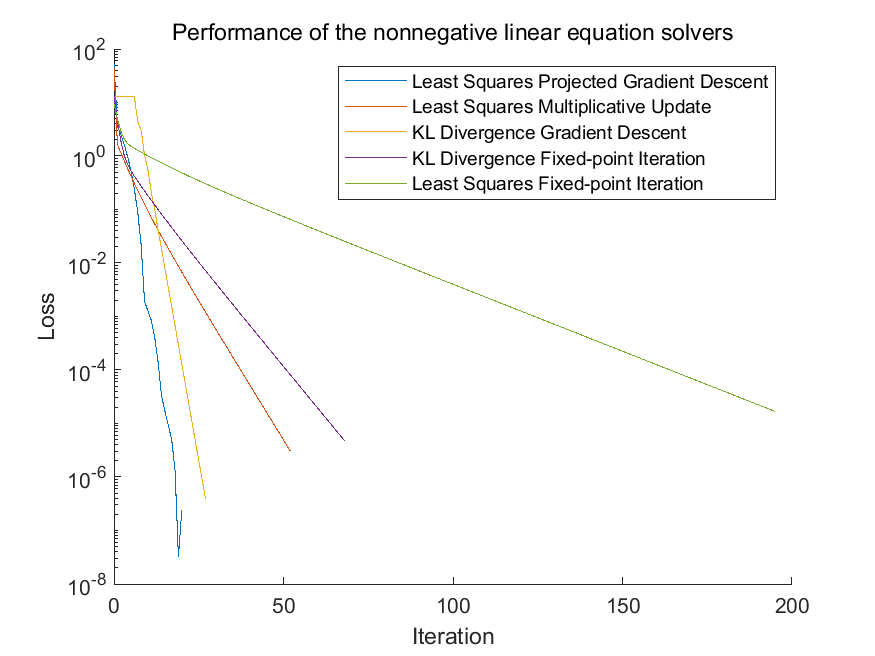
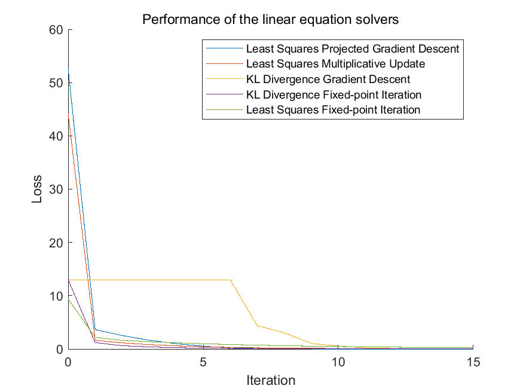
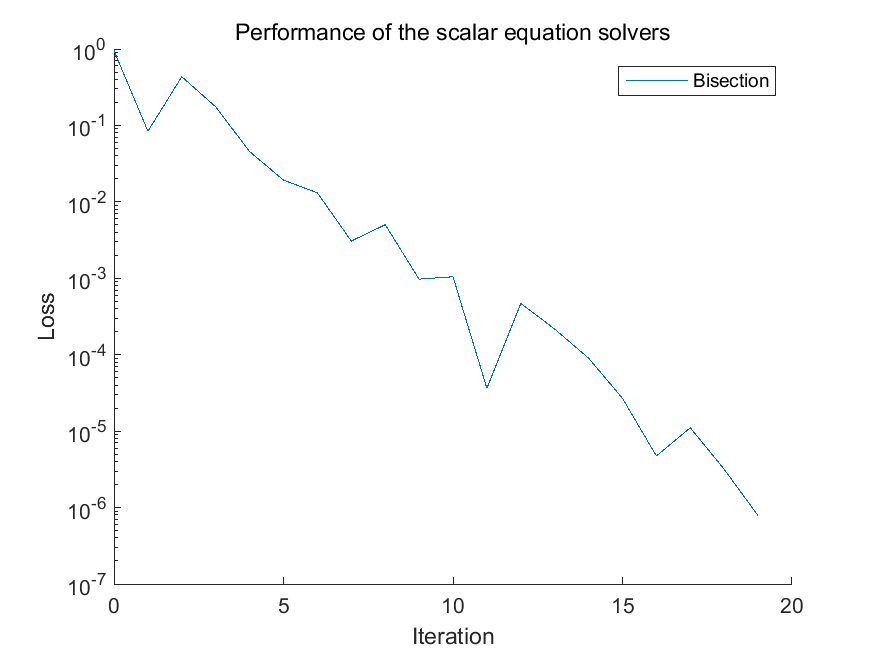

# Solvers

Here are my implementation of some useful solvers for mainly optimization problems in different programming languages. I hope you find them helpful.

## Problem definition

- Scalar equation: $f(x) = 0$
- Linear system: $\mathbf{A}\mathbf{x} = \mathbf{b}$
- Non-negative linear system: $\mathbf{A}\mathbf{x} = \mathbf{b}$ subject to $\mathbf{x} \succeq 0$
- Non-negative least squares: $\min_{\mathbf{x}} \frac{1}{2}\|\mathbf{A}\mathbf{x} - \mathbf{b}\|_2^2$ subject to $\mathbf{x} \succeq 0$
- Non-negative quadratic programming: $\min_{\mathbf{x}} \frac{1}{2}\mathbf{x}^\top\mathbf{Q}\mathbf{x} + \mathbf{c}^\top\mathbf{x}$ subject to $\mathbf{x} \succeq 0$

## List of solvers

- [x] Scalar equation solver ([MATLAB](./MATLAB/src/bisection_fsolve.m))
    - Algorithm: Bisection method
    - Self-contained
- [x] Non-negative linear system solver ([MATLAB](./MATLAB/src/fpi_kldivergence.m))
    - Optimization object: KL-Divergence
    - Algorithm: Fixed-point iteration
    - Extra requirement: The matrix $\mathbf{A}$ must be non-negative
    - Self-contained
- [x] Non-negative linear system solver ([MATLAB](./MATLAB/src/fpi_lsqnonneg.m))
    - Optimization object: Least Squares
    - Algorithm: Fixed-point iteration
    - Self-contained
- [x] Non-negative linear system solver ([MATLAB](./MATLAB/src/gd_kldivergence.m))
    - Optimization object: KL-Divergence
    - Algorithm: Gradient Descent
    - Extra requirement: The matrix $\mathbf{A}$ must be non-negative
    - Self-contained
- [x] Non-negative linear system solver ([MATLAB](./MATLAB/src/pgd_lsqnonneg.m))
    - Optimization object: Least Squares
    - Algorithm: Projected Gradient Descent
    - Self-contained
- [x] Non-negative quadratic programming solver ([MATLAB](./MATLAB/src/pgd_quadprog.m))
    - Algorithm: Projected Gradient Descent
    - Self-contained
- [x] Non-negative quadratic programming solver ([MATLAB](./MATLAB/src/multipupd_quadprognonneg.m))
    - Algorithm: Multiplicative update
    - Self-contained
- [x] Linear system solver ([MATLAB](./MATLAB/src/jacobi_lsqr.m))
    - Algorithm: Jacobi iteration
    - Self-contained
- [x] Linear system solver ([MATLAB](./MATLAB/src/gauss_seidel_lsqr.m))
    - Algorithm: Gauss-Seidel iteration
    - Self-contained
- [x] Linear system solver ([MATLAB](./MATLAB/src/sor_lsqr.m))
    - Algorithm: SOR iteration
    - Self-contained

## Usage

### MATLAB

Clone the repository or download the source code from release and add the path to the MATLAB environment. Alternatively, you can add this repository as a Git submodule to your project.

## Performance

