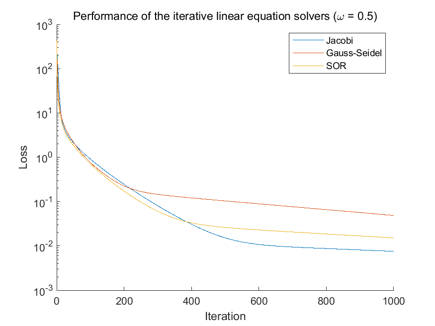

# Solvers

Here are my implementation of some useful solvers for mainly optimization problems in different programming languages. I hope you find them helpful.

## List of solvers

- [x] Scalar equation solver ([MATLAB](./MATLAB/bisection_fsolve.m))
    - Algorithm: Bisection method
- [x] Non-negative linear equation solver ([MATLAB](./MATLAB/fpi_kldivergence.m))
    - Optimization object: KL-Divergence
    - Algorithm: Fixed-point iteration
- [x] Non-negative linear equation solver ([MATLAB](./MATLAB/fpi_lsqnonneg.m))
    - Optimization object: Least Squares
    - Algorithm: Fixed-point iteration
- [x] Non-negative linear equation solver ([MATLAB](./MATLAB/gd_kldivergence.m))
    - Optimization object: KL-Divergence
    - Algorithm: Gradient Descent
- [x] Non-negative linear equation solver ([MATLAB](./MATLAB/pgd_lsqnonneg.m))
    - Optimization object: Least Squares
    - Algorithm: Projected Gradient Descent
- [x] Non-negative quadratic programming solver ([MATLAB](./MATLAB/pgd_quadprog.m))
    - Algorithm: Projected Gradient Descent
- [x] Non-negative quadratic programming solver ([MATLAB](./MATLAB/multipupd_quadprognonneg.m))
    - Algorithm: Multiplicative update

**NOTE: Fixed-point iteration may not converge. You'll receive a warning message when using solvers based on this algorithm.**

## Performance

